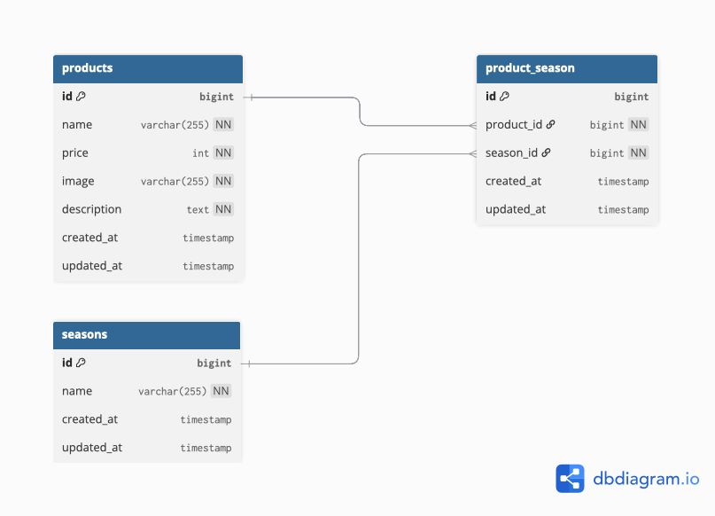

# mogitate（商品管理アプリ）

## 環境構築
### Docker
- git clone <本リポジトリ>
- docker compose up -d --build

### Laravel (コンテナ内)
- docker compose exec php bash
- cp .env.example .env && 適宜 DB 接続を調整
- php artisan key:generate
- php artisan migrate
- php artisan db:seed   # 画像つきダミーデータ投入
- php artisan storage:link   # /public/storage シンボリックリンク作成

## 開発環境
- 一覧: http://localhost/products
- 登録: http://localhost/products/register
- 詳細: http://localhost/products/detail/{productId}
- 検索: http://localhost/products/search
- 更新: PATCH http://localhost/products/{productId}/update
- 削除: DELETE http://localhost/products/{productId}/delete
- phpMyAdmin: http://localhost:8080/（docker-compose 同梱の場合）

## 使用技術（実行環境）
- PHP 8.2
- Laravel 12.41.1
- MySQL 8.4
- nginx latest
- Node 18+ / npm（フロントビルド用）

## 補足
- `storage/app/public` にダミー画像をシード済みでコミットしています。`storage:link` を必ず実行してください。
- `.env` は同梱していないので `.env.example` をコピーして使用してください。

 ER図
